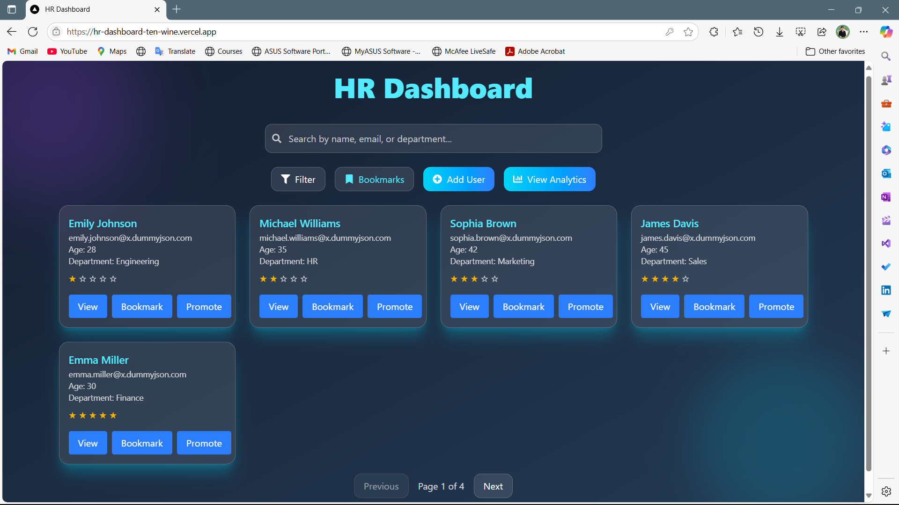
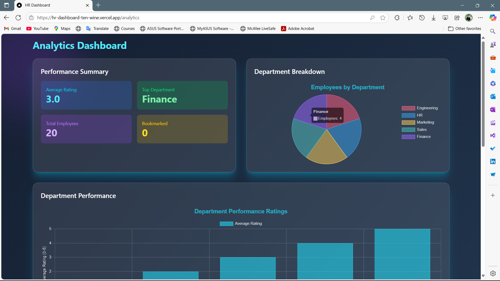
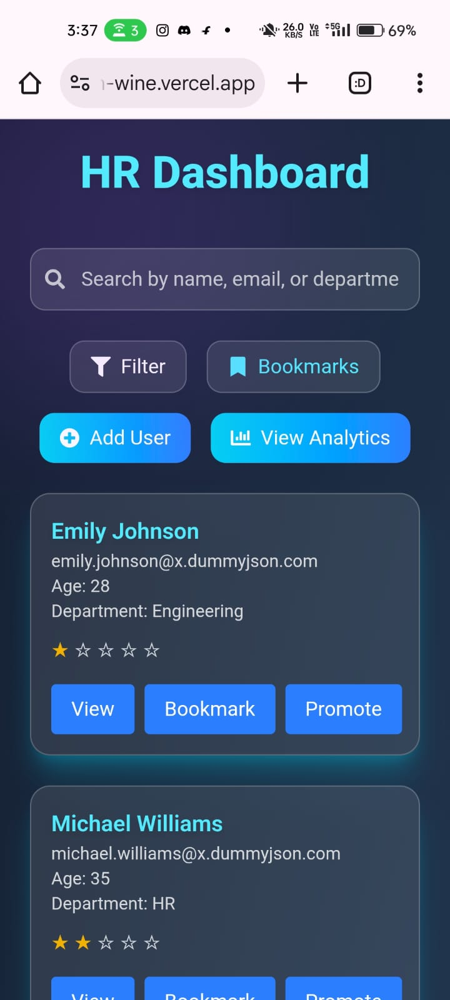

# 💼 HR Dashboard with Next.js

A feature-rich HR Dashboard built using **Next.js App Router**, **Zustand**, **NextAuth.js**, **Chart.js**, and **Tailwind CSS**. This app displays a searchable and filterable list of employees, bookmark management, performance analytics, and dynamic employee profiles.

---

## ⚙️ Installation & Setup

### 1. Clone the repository

```bash
git clone https://github.com/sparshbansal-08/HR-Dashboard.git
cd hr-dashboard
```

### 2. Install dependencies

```bash
npm install
```

### 3. Run the development server

```bash
npm run dev
```

### 4. Login credentials

Use the following mock credentials to log in:

```
Username: admin
Password: admin
```


---

## 🔗 Live Preview

[🚀 View Live Demo](https://hr-dashboard-ten-wine.vercel.app/)

---

## 📸 Screenshots

| Pre-login Page | Login Page | Dashboard | Analytics | Mobile View |
|----------------|------------|-----------|-----------|-------------|
|  |  |  |  |  |


---

## 🔧 Tech Stack

- **React** with **Next.js App Router**
- **Tailwind CSS** for responsive, utility-first UI
- **JavaScript (ES6+)**
- **Zustand** for state management
- **Chart.js** for analytics visualization
- **NextAuth.js** for authentication

---

## 🎯 Features

### 🏠 Dashboard Homepage (`/`)
- Fetches employee data from `dummyjson.com`
- Displays employee cards with:
  - Full Name, Email, Age, Department (mocked)
  - ⭐ Performance Rating (1–5 stars)
  - 📍 Actions: View, Bookmark, Promote

### 🔍 Search & Filter
- Search users by Name, Email, or Department
- Multi-select filters:
  - Department
  - Performance Rating

### 👤 Dynamic User Profile (`/employee/[id]`)
- Detailed info:
  - Address, Phone, Bio, Performance History
- Tabbed Interface:
  - **Overview** – Basic Info & Stats
  - **Projects** – Mock Projects
  - **Feedback** – Add/View Feedback (UI Only)
- Smooth animated transitions between tabs

### 📌 Bookmarks Page (`/bookmarks`)
- View all bookmarked employees
- Actions:
  - Remove from bookmarks
  - Promote / Assign to Project (UI only)

### 📊 Analytics Page (`/analytics`)
- 📈 Average rating by department (Chart.js)
- 📉 Bookmarked employees over time (mocked)
- Server-side rendering for better performance

### 🔐 Authentication
- Login with **NextAuth.js**
- Simple mock credentials (`admin / admin`)

---

### ⭐️ Bonus
- 🔏 Authentication (NextAuth.js)
- 👤 Add a “Create User” modal 
- 📃 Pagination
- 🪄 Animate content transitions (Framer Motion)

---

## ✅ Features Implemented

- ✅ Dashboard with employee cards
- ✅ Search & multi-filter
- ✅ Dynamic route `/employee/[id]`
- ✅ Tabbed layout for detailed profile
- ✅ Bookmark manager
- ✅ Analytics with department-wise ratings
- ✅ Zustand for state management
- ✅ Authentication with NextAuth.js
- ✅ Paginate
- ✅ Create User
- ✅ Animations
- ✅ Reusable Components (Card, Modal, Button, Badge, etc.)
- ✅ Mobile Responsive Design
- ✅ Custom Hooks (`useBookmarks`, `useSearch`)
- ✅ Component-level loading and error states
- ✅ Clean, modular code structure


---


## ✨ Credits

Built with ❤️ by Sparsh Bansal using the [Next.js App Router](https://nextjs.org/docs/app).